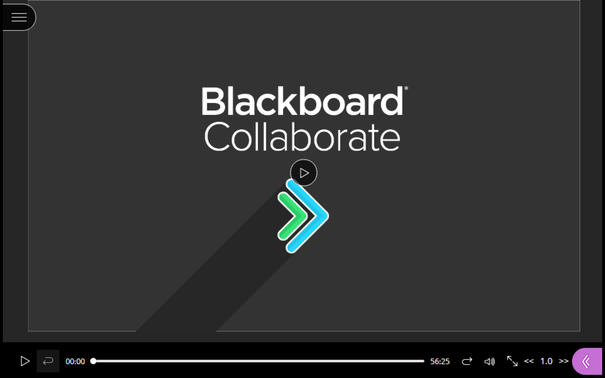
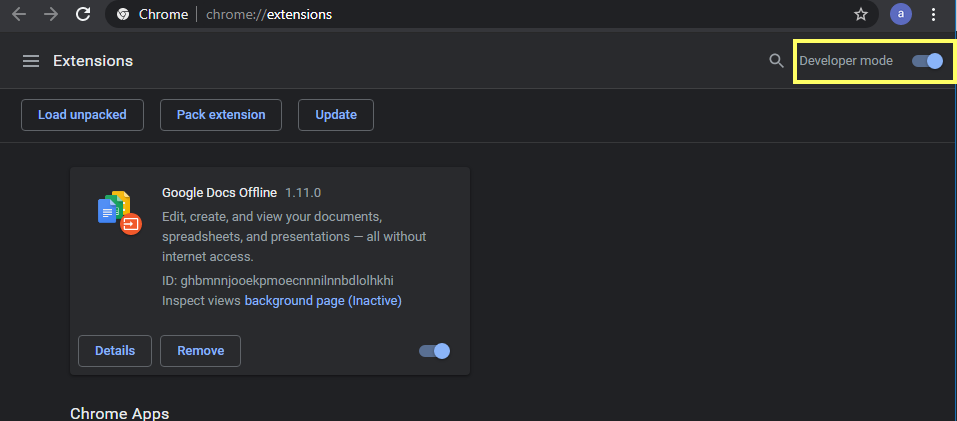
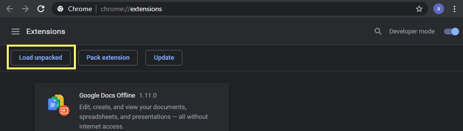

# blackboard-collab-speed-control

# About

Control the speed of Blackboard Collaborate videos

  

# Install

**Chrome Extension**

Get the Chrome Extension [here](https://chrome.google.com/webstore/detail/blackboard-collab-speed-c/ocacgafaaahoakloknkbaikjmcohmhda)

https://chrome.google.com/webstore/detail/blackboard-collab-speed-c/ocacgafaaahoakloknkbaikjmcohmhda

**Alternative Install**

- download this repository

- go to extensions 
[Chrome](chrome://extensions/) chrome://extensions/
[Opera](opera://extensions) opera://extensions

- ensure developer mode is turned on in the top right

  

- click *Load unpacked* and select the `chrome-ext` folder you downloaded earlier 

  

